<div align="center">
  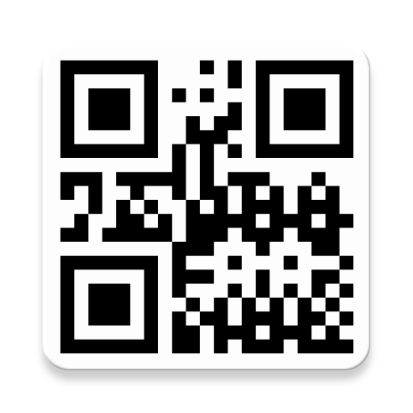
</div>
<h3 align="center">QrCode</h3>
<p align="center">
  <br>
  Scan and create QR Codes with ease.<br>
</p>

<br>

| <a href="https://play.google.com/store/apps/details?id=fr.smarquis.qrcode">Android</a> | <a href="https://simonmarquis.github.io/QrCode/">Web</a> |
|---|---|
| 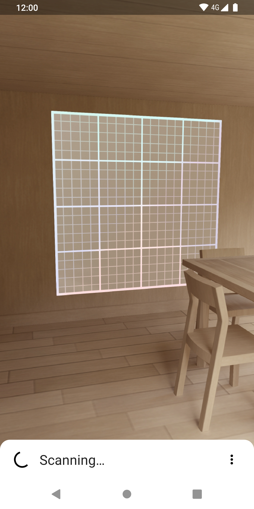 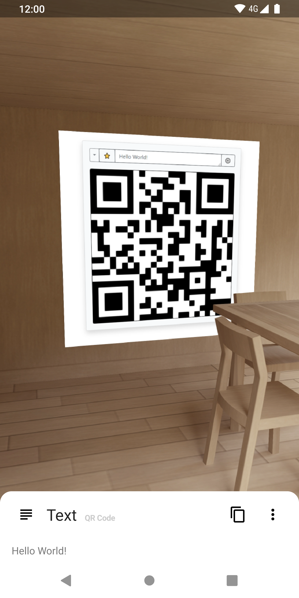 | 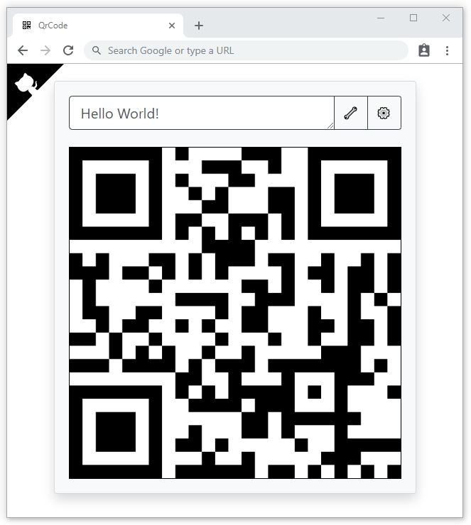 |
| Barcode processors:<ul><li><a href="https://firebase.google.com/docs/ml-kit/android/read-barcodes#before-you-begin" title="Apart from the initial Firebase ML Kit Barcode Model download">✈️</a> <a href="https://firebase.google.com/docs/ml-kit/read-barcodes">Firebase ML Kit</a></li><li>✈️ <a href="https://github.com/zxing/zxing/">ZXing</a></li></ul> | QR Code generators:<ul><li>✈️ <a href="https://github.com/davidshimjs/qrcodejs">QRCode.js</a></li><li>🌎 <a href="https://zxing.appspot.com/generator/">ZXing</a></li><li>🌎 <a href="https://developers.google.com/chart/infographics/docs/qr_codes">Google Charts</a></li></ul> |

#### Devices without touchscreen

> Mostly based on [android.hardware.touchscreen](https://developer.android.com/reference/android/content/pm/PackageManager.html#hasSystemFeature(java.lang.String))

The scanning behavior is simplified and it will automatically:
- Copy content to clipboard
- Open web links
- Open deeplinks (geo, mail, tel, sms, etc.)

Non-exhaustive list of devices without touch screen support:
- Google: `Glass`, `Glass Enterprise Edition`
- Vuzix: `Blade®`, `M300`, `M300XL`
- Realwear: `HMT-1™`, `HMT-1Z1™`
- …

#### Barcode formats

- Aztec
- Codabar
- Code 39, Code 93, Code 128
- Data Matrix
- EAN-8, EAN-13
- ITF
- MaxiCode
- PDF417
- QR Code
- UPC-A, UPC-E

#### Content types

- <details><summary>Text</summary>

  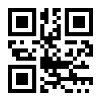
  
  ```
  Hello, World!
  ```
  
  </details>
- <details><summary>WiFi</summary>
  
  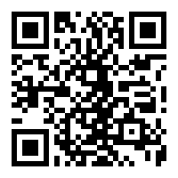
  
  ```
  WIFI:S:MyWiFi;T:WPA;P:letmein;H:true;;
  ```

  </details>
- <details><summary>Url</summary>
  
  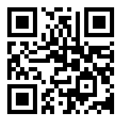
  
  ```
  https://example.com
  ```

  </details>
- <details><summary>Phone</summary>
  
  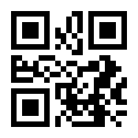
  
  ```
  tel:+1234567890
  ```

  </details>
- <details><summary>Sms</summary>
  
  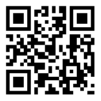
  
  ```
  smsto:+1234567890:Hello, World!
  ```

  </details>
- <details><summary>Email</summary>
  
  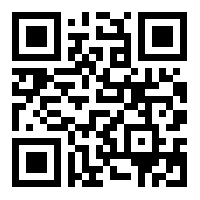
  
  ```
  mailto:user@example.com
  ```

  </details>
- <details><summary>GeoPoint</summary>
  
  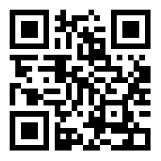
  
  ```
  geo:48.8566,2.3522?q=Earth
  ```

  </details>
- <details><summary>ContactInfo (vCard)</summary>
  
  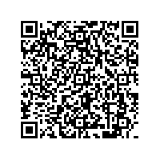
  
  ```
  BEGIN:VCARD
  VERSION:3.0
  N:User
  ORG:Example
  TITLE:Head
  TEL:+1234567890
  URL:https://example.com
  EMAIL:user@example.com
  ADR:Earth
  NOTE:Hello\, World!
  END:VCARD
  ```
  
  </details>
- <details><summary>ContactInfo (MeCard)</summary>
  
  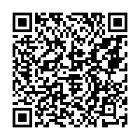
  
  ```
  MECARD:N:User;ORG:Example;TEL:+1234567890;URL:https\://example.com;EMAIL:user@example.com;ADR:Earth;NOTE:Hello, World!Head;;
  ```
  
  </details>
- <details><summary>CalendarEvent</summary>
  
  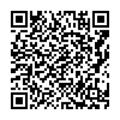
  
  ```
  BEGIN:VEVENT
  SUMMARY:Meeting
  DTSTART:20200101T201400Z
  DTEND:20200101T211400Z
  LOCATION:Earth
  DESCRIPTION:Readme
  END:VEVENT
  ```

  </details>

## License

```
Copyright 2019 Simon Marquis

Licensed under the Apache License, Version 2.0 (the "License");
you may not use this file except in compliance with the License.
You may obtain a copy of the License at

    http://www.apache.org/licenses/LICENSE-2.0

Unless required by applicable law or agreed to in writing, software
distributed under the License is distributed on an "AS IS" BASIS,
WITHOUT WARRANTIES OR CONDITIONS OF ANY KIND, either express or implied.
See the License for the specific language governing permissions and
limitations under the License.
```
